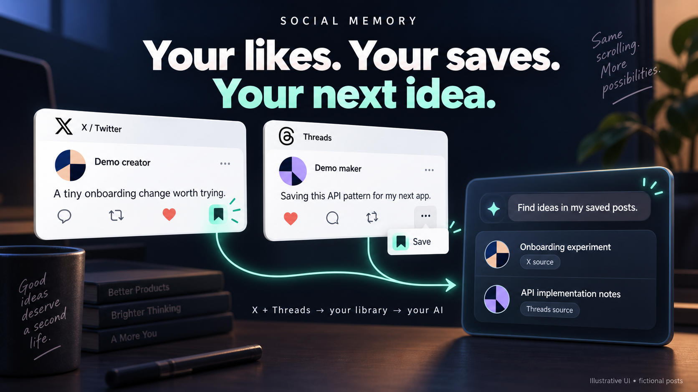
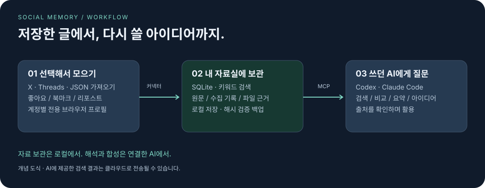
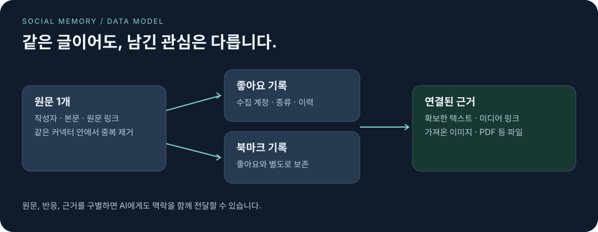

# Social Memory

**트위터 북마크와 스레드 저장 글을, 다음 아이디어로.**

[English](README.md) · [한국어](README.ko.md)

**X(트위터)와 Threads(스레드)**에서 좋아요·북마크·리포스트한 글을 내 컴퓨터에 모아두세요. **Codex나 Claude Code**에게 “지난주 저장한 글 중 앱에 쓸 아이디어 찾아줘”라고 물으면, 연결된 자료실에서 근거를 찾아 원문 링크와 함께 활용할 수 있습니다.

> **개발 프리뷰입니다.** 로컬 CLI + SQLite + 읽기 전용 MCP로 구성됩니다. Chrome 수집은 구현 및 로컬 HTML 테스트를 마쳤지만 실계정 수집은 아직 미검증입니다. 소스는 PolyForm Perimeter License 1.0.1로 공개됩니다.

[로컬 데모 실행](#로컬-데모-실행) · [계정 연결](#계정-연결) · [AI에게 질문](#ai에게-질문) · [현재-한계](#현재-한계)

## 무엇을 모을 수 있나요?

| 저장한 곳 | 선택할 수집 대상 | 나중에 이렇게 물어보세요 |
| --- | --- | --- |
| **X(트위터)** | 좋아요 · 북마크 · 리포스트 | “북마크해 둔 API 구현 팁 찾아줘.” |
| **Threads(스레드)** | 좋아요 · 저장한 글 · 리포스트 | “지난주 저장한 마케팅 아이디어 비교해줘.” |
| **내 JSON 내보내기 파일** | 게시물과 첨부 근거 파일 | “이 프로젝트에 참고할 자료를 찾아줘.” |

계정마다 수집할 항목을 고릅니다. 좋아요만 모아도 되고 북마크만 모아도 됩니다. 둘 다 선택한 글은 원문 한 개로 보관하고, 수집된 이유만 구별해 둡니다.

## 실제로는 이렇게 사용합니다

1. **평소처럼 저장합니다.** 트위터에서 구현 팁을 북마크하고, 스레드에서 눈에 들어온 마케팅 사례를 저장합니다.
2. **Mac에서 모아둡니다.** 처음 로그인하고 시험 수집에 성공한 뒤 수집 간격을 설정합니다. 커넥터가 가져온 자료가 로컬 자료실에 쌓입니다.
3. **작업하던 AI에게 묻습니다.** 연결된 Codex나 Claude Code에서 “지난주 트위터 북마크랑 스레드 저장 글 중 새 앱에 쓸 아이디어를 추려줘. 출처도 붙여줘”라고 요청합니다.
4. **원문을 보며 구체화합니다.** 링크를 열어 근거를 확인하고, 비교한 결과를 실험안이나 구현 계획으로 발전시킵니다.

위 흐름은 **이해를 돕기 위한 사용 예시**이며 실계정 녹화 데모가 아닙니다. 결과는 실제 수집된 자료에 따라 달라지고, Chrome 실계정 수집 범위는 아직 검증이 필요합니다.

| 지금 하는 일 | 질문 예시 |
| --- | --- |
| 앱 개발 | “트위터 북마크에서 이 기능에 참고할 구현 방법을 찾아줘.” |
| 마케팅 기획 | “지난주 스레드 저장 글을 마케팅 방식별로 묶고 원문을 보여줘.” |
| 시나리오 작성 | “저장한 글에서 서사 장치를 찾아줘. 새로 만든 설정은 AI 합성으로 표시해줘.” |
| 관심사 돌아보기 | “좋아요한 주제와 북마크한 주제에 어떤 차이가 있어?” |

## 저장할 때는 이유가 있었으니까

앱을 만들 때 참고하려던 구현 팁. 가격 정책이 눈에 들어온 서비스. 다음 이야기에 써보고 싶었던 설정.

Social Memory는 원문, 저장한 방식, 관련 근거를 함께 보관합니다. 연결된 AI에게 필요한 자료를 찾아 달라고 한 뒤, 비교하고 새로운 아이디어로 발전시킬 수 있습니다.

AI 연결 후에는 이렇게 물어보세요.

> “온보딩 관련 저장 글을 찾아서 실험할 아이디어 세 개를 제안해줘. 출처도 붙여줘.”
>
> “지난달 좋아요와 북마크에서 관심사 차이를 찾아줘.”
>
> “지금 만드는 기능에 참고할 만한 구현 방법을 예전 자료에서 찾아줘.”

위 문장은 사용 예시입니다. 실제 검색 결과나 자동으로 제공되는 정기 보고서가 아닙니다.

## 링크와 함께, 관심의 맥락도 보관합니다



- **좋아요와 북마크를 구별합니다.** 리포스트와 직접 가져온 자료도 별도 기록으로 남습니다.
- **내 컴퓨터에 자료실을 둡니다.** 원문·수집 이력은 SQLite에, 파일 근거는 콘텐츠 해시로 보관합니다.
- **쓰던 AI에서 활용합니다.** Codex나 Claude Code가 읽기 전용 MCP로 자료를 찾고 분류·요약·합성을 담당합니다.
- **수집 경로를 선택합니다.** Chrome, 선택형 Aside, X API, 정해진 형식의 JSON 가져오기를 지원합니다.
- **아이디어의 출처를 확인합니다.** 원문 링크, 작성자, 수집 종류, 확보된 근거를 함께 조회합니다.

자료실은 로컬에 있습니다. 다만 클라우드 AI에게 전달한 검색 결과는 해당 서비스의 설정에 따라 외부로 전송될 수 있습니다. Social Memory 자체 LLM API 키는 필요하지 않지만, 연결한 AI의 구독 한도와 원천 API 이용료는 별개입니다.



**좋아요와 북마크는 ‘무엇을 수집할지’ 정하는 조건입니다. 선택한 조건 중 하나만 해당해도 수집하며, 둘 다 해당하는 글도 한 개로 보관하고 검색 결과에 한 번만 표시합니다.**

| 내 설정 | 좋아요만 한 글 | 북마크만 한 글 | 둘 다 한 글 |
| --- | --- | --- | --- |
| 북마크만 수집 (`--include save`) | 수집 안 함 | 수집 | 한 번 수집 |
| 좋아요만 수집 (`--include like`) | 수집 | 수집 안 함 | 한 번 수집 |
| 둘 다 수집 (`--include like,save`) | 수집 | 수집 | 한 번 수집 |

“좋아요는 그냥 공감 표시로 쓰고, 다시 볼 글만 북마크한다”면 **북마크만** 선택하면 됩니다. 반대로 좋아요만 수집 대상으로 삼아도 됩니다. 내부에는 수집된 이유를 붙여둘 뿐, 반응 종류별로 게시물 사본을 만들지는 않습니다. 수집 조건을 변경해도 이미 보관한 글은 자동 삭제되지 않습니다.

같은 플랫폼의 게시물이 Chrome·Aside·API 또는 향후 확장 커넥터처럼 서로 다른 경로로 들어와도 한 개로 보관합니다.

## 로컬 데모 실행

**Node.js 22.16 이상**이 필요합니다. 아래는 macOS/Linux 셸 기준이며, 로컬에 받은 소스 폴더에서 시작합니다. 공개 npm 배포를 전제로 하지 않습니다.

```bash
cd /path/to/social-memory
npm install --ignore-scripts
npm install --global .
social-memory --version

# 소스 폴더 밖에 데모 자료실을 만듭니다.
export SOCIAL_MEMORY_DATA_DIR="$HOME/social-memory-demo"
social-memory init --data-dir "$SOCIAL_MEMORY_DATA_DIR" --json

social-memory connector configure fixture \
  --account fictional_reader --include like,save --json
social-memory sync --json
social-memory search "fixture" --kind save --json
```

합성 데이터이므로 SNS 로그인이 필요 없습니다. 전역 설치 없이 쓰려면 `social-memory` 대신 `node /absolute/path/to/social-memory/src/cli.mjs`를 실행하세요.

실제 자료는 **다른 폴더**에 모아 데모 데이터와 섞이지 않게 합니다.

```bash
export SOCIAL_MEMORY_DATA_DIR="$HOME/social-memory-data"
social-memory init --data-dir "$SOCIAL_MEMORY_DATA_DIR" --json
```

새 터미널에서는 환경변수를 다시 설정하거나 셸 설정 파일에 등록하세요. AI의 MCP 설정에도 같은 절대경로를 지정합니다.

## 계정 연결

Google Chrome을 먼저 설치하세요. `playwright-core`로 설치된 Chrome을 실행하므로 별도 브라우저 다운로드는 필요하지 않습니다.

### Chrome으로 Threads 연결

```bash
# 열린 창에서 로그인한 뒤 창을 닫으세요.
social-memory browser open threads

# 로그인된 계정을 자동 확인하므로 계정명이나 프로필 ID를 입력하지 않습니다.
social-memory connector connect threads-chrome --include save --json

# 처음에는 소량만 확인합니다.
social-memory sync --connector threads-chrome --kind save --limit 3 --json
```

기본값인 `threads-default` 전용 프로필을 `SOCIAL_MEMORY_DATA_DIR/chrome-profiles/` 아래에 사용합니다. 평소 쓰는 Chrome 프로필과 분리되며, 로그인 계정 확인에 성공한 뒤에만 핸들을 등록합니다.

### Chrome으로 X 연결

```bash
social-memory browser open x
social-memory connector connect x-chrome --include save --json
social-memory sync --connector x-chrome --kind save --limit 3 --json
```

`like`는 좋아요, `save`는 저장/북마크, `repost`는 리포스트입니다. 원하는 항목만 선택하세요. `social-memory connector status --json`으로 등록한 계정과 확인된 로그인 계정을 조회합니다. 계정이 다르거나 지원하는 화면 표식이 없으면 수집을 중단합니다.

대부분은 여기까지만 하면 됩니다. 두 번째 계정을 연결할 때만 로컬 프로필 이름을 정해 두 명령에 같이 넣습니다.

```bash
social-memory browser open threads --profile-ref threads-work
social-memory connector connect threads-chrome \
  --profile-ref threads-work --include save --json
```

### 다른 수집 경로

| 커넥터 | 필요한 것 | 현재 검증 범위 |
| --- | --- | --- |
| `threads-chrome`, `x-chrome` | Chrome + 전용 프로필 로그인 | 로컬 DOM 테스트, 실계정 미검증 |
| `threads`, `x-aside` | Aside CLI + 전용 Aside 계정 ID | 과거 소량 실계정 확인, 지속 동작 보장 아님 |
| `x` | 사용자 OAuth 토큰 | API 계약 오프라인 테스트, 실계정 확인 대기 |
| `import` | 정해진 형식의 JSON | 로컬 가져오기 테스트 |
| `fixture` | 외부 서비스 불필요 | 설치 확인용 합성 데이터 |

Aside는 `aside account list`로 계정 ID를 찾고, 해당 SNS 계정이 로그인된 ID(예: `u1`)를 `--profile-ref`에 넣습니다. 확인 후 `connector connect threads --profile-ref u1 --include save`를 실행하며, X는 `x-aside`를 사용합니다.

X API는 사용자 OAuth 토큰을 환경변수에 안전하게 준비한 뒤, 값이 아닌 **환경변수 이름**을 등록합니다.

```bash
social-memory connector configure x \
  --account reader_handle --include like,save \
  --credential-env SOCIAL_MEMORY_X_ACCESS_TOKEN --json
```

예약 실행에는 macOS Keychain 참조가 필요합니다.
`--keychain-service social-memory.x --keychain-user reader_handle`를 사용하며, 자격증명은 먼저 안전하게 등록해야 합니다. X의 현재 API 권한과 이용료는 별도로 확인하세요.

## AI에게 질문

연결에 필요한 파일을 생성합니다.

```bash
social-memory agent scaffold \
  --client codex --output "$HOME/social-memory-codex-setup" --json
```

Claude Code는 `--client claude`를 사용합니다. 생성된 `INSTALL.md`에 따라 스킬을 설치하고 MCP 설정을 병합하세요. **파일 생성만으로 AI 연결이 활성화되지는 않습니다.**

| MCP 도구 | AI가 할 수 있는 일 |
| --- | --- |
| `search_sources` | 본문 검색 및 커넥터·계정·수집 종류·날짜 필터 |
| `get_source` | 원문과 수집 기록, 근거 조회 |
| `list_capture_kinds` | 수집 종류 확인 |
| `get_health` | 자료실 개수와 상태 확인 |

현재 검색은 **SQLite FTS5 키워드 검색**입니다. 임베딩 기반 의미 검색은 아닙니다. AI가 질문을 여러 검색어로 바꾸고 결과를 해석합니다. 원문에서 확인한 사실과 새롭게 만든 아이디어를 구별해 달라고 요청하세요.

일반 ChatGPT 웹 대화가 이 로컬 stdio MCP에 자동 연결되지는 않습니다. 원격 연결과 ChatGPT 대화창으로 일일 보고서를 자동 전달하는 기능은 아직 없습니다.

## 일정에 맞춰 수집

macOS에서는 **선택한 모든 계정 × 수집 종류**가 수동 동기화에 성공한 뒤 예약할 수 있습니다.

```bash
social-memory sync --json
social-memory schedule readiness --json
social-memory schedule install --interval-minutes 1440 --json
social-memory schedule status --json
```

특정 시각이 아닌 24시간 간격 설정입니다. Mac이 실행 가능한 상태여야 하며 잠자기·로그아웃·인증 만료로 수집이 중단될 수 있습니다. 해제는 `social-memory schedule uninstall --json`입니다.

예약 기능은 원문을 수집합니다. 별도의 AI 워크플로를 설정하지 않았다면 요약은 연결한 AI에게 요청할 때 만들어집니다.

## 가져오기·검색·백업

```bash
social-memory import --file /absolute/path/to/export.json \
  --account my_archive --include like,save --json
social-memory search "pricing" --kind save --json
social-memory source SOURCE_ID --json
social-memory health --json
social-memory doctor --json

social-memory backup create --output "$HOME/social-memory-backup" --json
social-memory backup restore --from "$HOME/social-memory-backup" \
  --data-dir "$HOME/social-memory-restored" --json
```

[가져오기 스키마](schemas/capture-export-v1.schema.json)와 [합성 예제](examples/import.v1.json)를 참고하세요. 파일 근거의 경로는 내보내기 JSON이 있는 폴더 아래의 상대경로여야 합니다. 백업은 해시를 검증하며 복원은 기존 자료실을 덮어쓰지 않고 새 폴더를 만듭니다. 브라우저 세션은 백업에서 제외되므로 새 장비에서는 다시 로그인합니다.

## 현재 한계

- **새 자료실 필요:** 이 개발 스키마에는 의도적으로 마이그레이션 계층이 없습니다. 이전 스키마로 만든 자료실은 변환하지 않고 거부하므로 `SOCIAL_MEMORY_DATA_DIR`을 새 폴더로 지정해야 합니다.

- **운영체제:** macOS 우선 검증, Linux 코어 CI 포함. Windows CLI 초기화는 수정했지만 실기기 전체 흐름은 미검증입니다. 스케줄러는 macOS 전용입니다.
- **화면 변경:** Chrome은 지원하는 한국어/영어 제목과 DOM 구조가 필요합니다. X/Threads가 화면을 바꾸면 수집이 중단될 수 있습니다.
- **수집 범위:** Chrome은 게시물 ID로 이어받습니다. 기준 게시물이 없어지면 명시적으로 실패합니다. 목록 끝 판단은 추정 방식으로, 전체 과거 기록 수집은 보장하지 않습니다. 최신 글은 현재 과거 목록 순회를 마친 뒤 다시 확인합니다.
- **미디어:** 가져온 파일은 보관할 수 있습니다. 브라우저는 현재 확보 가능한 미디어 메타데이터와 링크를 기록합니다. 전체 자동 다운로드, OCR, PDF 본문 추출, 영상 전사는 미구현입니다.
- **사용 화면:** CLI와 AI 연결을 제공합니다. 데스크톱 GUI, 설정 마법사, 호스팅 서비스, 네이버 블로그 커넥터는 없습니다.

## 개발과 라이선스

```bash
npm test
npm run check
npm run skill:check
npm run package:check
# 선택 검사: 설치된 Chrome으로 로컬 HTML만 테스트합니다.
SOCIAL_MEMORY_CHROME_TEST=1 node --test test/chrome-safety.test.mjs
```

로컬 검증은 `npm test`와 선택형 Chrome DOM 테스트로 수행합니다. 테스트 통과가 실계정 수집 가용성을 보장하지는 않습니다.

코어는 **원문(Source) / 수집 기록(Capture) / 근거(Evidence)**를 구분합니다. 커넥터는 정규화한 자료를 전달하고 AI는 해석을 담당합니다. [보안 경계](SECURITY.md)와 [변경 이력](CHANGELOG.md)을 확인하세요. 실계정 데이터·프로필·자격증명은 저장소 밖에 보관합니다.

Social Memory는 [PolyForm Perimeter License 1.0.1](LICENSE.md)에 따라 소스가 공개됩니다. 허용된 목적에 한해 사용·수정·배포할 수 있지만, Social Memory와 경쟁하는 제품이나 서비스를 제공할 수는 없습니다. OSI 승인 오픈소스 라이선스는 아닙니다.

태그된 버전은 `npm run release:check` 통과 후 GitHub Release 파일로 배포됩니다. npm 레지스트리 패키지는 현재 제공을 약속하지 않습니다.
