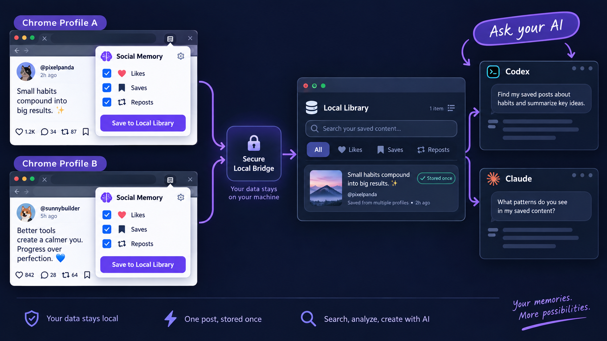
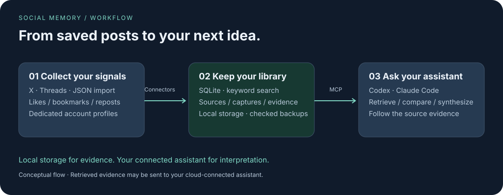
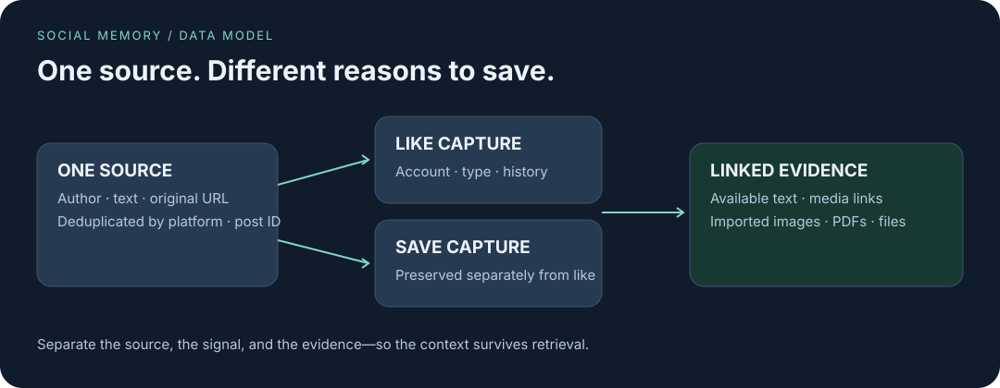

# Social Memory

**Your X (Twitter) bookmarks and Threads saves. Ready for your next idea.**

[English](README.md) · [한국어](README.ko.md)

Collect the posts you like, bookmark, and repost on **X (Twitter) and Threads** into a searchable local library. Then ask **Codex or Claude Code** to find implementation notes, compare marketing ideas, or help shape your next project—with links back to the originals.

> **Development preview.** Unpacked Chrome extension + local CLI + SQLite + read-only MCP. The extension and Chrome DOM collection are tested locally, but live X/Threads account collection is not yet verified. Source is available under the PolyForm Perimeter License 1.0.1.

[Try the local demo](#try-the-local-demo) · [Connect an account](#connect-an-account) · [Ask your assistant](#ask-your-assistant) · [Current limits](#current-limits)

## What can you collect?

| Where you save | Choose the signals | What you can ask later |
| --- | --- | --- |
| **X (Twitter)** | Likes · bookmarks · reposts | “Find the API implementation tips I bookmarked.” |
| **Threads** | Likes · saved posts · reposts | “Compare the marketing ideas I saved last week.” |
| **Your JSON exports** | Imported posts and supporting files | “Find references relevant to this project.” |

You decide which signals to collect for each account. If one post matches more than one selected signal, Social Memory stores the post once and keeps the reasons as metadata.

## See the everyday workflow

1. **Save as usual.** Bookmark an implementation tip on X. Save a marketing example on Threads.
2. **Connect the Chrome profile you already use.** Select likes, saves, and/or reposts in the extension. Your signed-in handle is detected automatically—no profile ID or password export.
3. **Ask where you work.** In your connected Codex or Claude Code session, ask: “Find useful ideas from last week’s X bookmarks and Threads saves for my new app. Cite the sources.”
4. **Go back to the evidence.** Open the original links, compare approaches, and ask the assistant to turn the findings into an experiment or implementation plan.

Results depend on the material collected; live-account coverage still needs verification.

| Your task | Example prompt |
| --- | --- |
| Build an app | “Find implementation methods in my X bookmarks relevant to this feature.” |
| Plan marketing | “Group last week’s Threads saves by marketing approach and show the original posts.” |
| Write a story | “Find narrative devices in my saved posts. Label any new premise as AI synthesis.” |
| Review your interests | “How do the topics I like differ from the ones I bookmark?” |

## You saved it for a reason

An implementation trick. A pricing example. A story premise. You saved the post—but when you need it, you have to remember where it was.

Social Memory keeps the source, how you saved it, and its supporting evidence together. A connected assistant can search that library and help you make something from it.

Example requests after connecting your assistant:

> “Find saved posts about onboarding and suggest three experiments. Link the sources.”
>
> “Compare what I liked with what I bookmarked last month.”
>
> “Find implementation notes relevant to this feature.”

These are example prompts, not sample results or built-in automatic reports.

## Keep the context, not just the link



- **Preserve your intent.** Likes, bookmarks, reposts, and manual imports stay separate.
- **Keep a local library.** SQLite stores sources and capture history; file evidence is stored by content hash.
- **Use your existing assistant.** Codex or Claude Code retrieves evidence through read-only MCP. The assistant handles grouping, summaries, and synthesis.
- **Choose your connector.** System Chrome, optional Aside, the X API, or a versioned JSON import.
- **Trace an idea back.** Source URLs, authors, capture types, and available evidence remain accessible.

The archive stays local. Evidence returned to a cloud-connected assistant can leave your machine under that assistant’s settings. Social Memory does not require its own LLM API key; your assistant’s usage limits and any source API charges still apply.



**Likes and bookmarks are collection filters. A post qualifies if it matches ANY selected filter. A post matching both is stored once and appears once in search.**

| Your selection | Liked only | Bookmarked only | Both |
| --- | --- | --- | --- |
| Bookmarks only (`--include save`) | Excluded | Collected | Collected once |
| Likes only (`--include like`) | Collected | Excluded | Collected once |
| Both (`--include like,save`) | Collected | Collected | Collected once |

Use likes to show appreciation and bookmarks to mark research? Select **bookmarks only**. Prefer collecting likes instead? Select likes only. Internal metadata records why a post qualified; it does not create a separate post copy for each reaction. Changing filters does not automatically delete previously archived posts.

The same platform post is also stored once when it arrives through different declared routes, such as the extension, CLI Chrome connector, Aside, or an API.

## Try the local demo

Requires **Node.js 22.16+**. These commands use a macOS/Linux shell. Start from a local source checkout; a public npm release is not assumed.

```bash
cd /path/to/social-memory
npm install --ignore-scripts
npm install --global .
social-memory --version

# Keep demo data outside the source checkout.
export SOCIAL_MEMORY_DATA_DIR="$HOME/social-memory-demo"
social-memory init --data-dir "$SOCIAL_MEMORY_DATA_DIR" --json

social-memory connector configure fixture \
  --account fictional_reader --include like,save --json
social-memory sync --json
social-memory search "fixture" --kind save --json
```

The fixture uses synthetic data and needs no SNS login. To run without a global install, replace `social-memory` with `node /absolute/path/to/social-memory/src/cli.mjs`.

Choose a **different directory** for real data so the fixture does not mix with your archive:

```bash
export SOCIAL_MEMORY_DATA_DIR="$HOME/social-memory-data"
social-memory init --data-dir "$SOCIAL_MEMORY_DATA_DIR" --json
```

Set this environment variable again in each new terminal, or put it in your shell configuration. Use the same absolute directory in your assistant’s MCP configuration.

## Connect an account

### Recommended: connect your everyday Chrome profile

Install the project and initialize a fresh library first:

```bash
cd /path/to/social-memory
npm install --ignore-scripts
npm install --global .

export SOCIAL_MEMORY_DATA_DIR="$HOME/social-memory-data"
social-memory init --data-dir "$SOCIAL_MEMORY_DATA_DIR" --json
```

Then connect Chrome:

1. Open `chrome://extensions`, enable **Developer mode**, choose **Load unpacked**, and select this repository's `extension` folder.
2. Copy the 32-letter extension ID shown by Chrome.
3. Install the private local bridge:

   ```bash
   social-memory extension install-host \
     --extension-id YOUR_EXTENSION_ID --json
   ```

4. Open X or Threads in that Chrome profile, sign in normally, click **Social Memory**, choose Likes, Saves, and/or Reposts, then click **Connect profile**.
5. Click **Collect now** for the first bounded collection. The extension detects the handle from the open site; you never type an account or profile ID into Social Memory.

Most people need only those steps. For another Chrome profile, load the same unpacked `extension` folder in that profile and click **Connect profile** once. Each profile keeps its own installation state, while a post collected more than once is still one Source in the local library.

The once-daily toggle is best effort: Chrome must be running, alarms can be delayed, and the extension does not wake a sleeping device. Use the macOS CLI scheduler below when collection must run without an everyday Chrome window.

Native Messaging host installation is currently implemented for macOS and Linux. The unpacked extension and Windows host installation remain unverified on Windows.

### Advanced: dedicated automation profile

The CLI can launch an isolated Chrome profile instead of reusing everyday Chrome. Install Google Chrome first; `playwright-core` controls the installed browser without downloading another one.

### Threads with Chrome

```bash
# Log in in the opened window, then close it.
social-memory browser open threads

# The connector reads the signed-in handle. No account name or profile ID is needed.
social-memory connector connect threads-chrome --include save --json

# Begin with a small collection.
social-memory sync --connector threads-chrome --kind save --limit 3 --json
```

This uses the isolated `threads-default` profile under `SOCIAL_MEMORY_DATA_DIR/chrome-profiles/`; your everyday Chrome profile is not reused. The signed-in handle is discovered and stored only after verification succeeds.

### X with Chrome

```bash
social-memory browser open x
social-memory connector connect x-chrome --include save --json
social-memory sync --connector x-chrome --kind save --limit 3 --json
```

Select only what you want: `like`, `save`, `repost`. Check the configured and authenticated identities with `social-memory connector status --json`. Browser collection rejects account mismatches and missing supported page markers.

For a second dedicated automation account, choose a local profile name explicitly and use it for both commands:

```bash
social-memory browser open threads --profile-ref threads-work
social-memory connector connect threads-chrome \
  --profile-ref threads-work --include save --json
```

### Other connectors

| Connector | Needs | Status |
| --- | --- | --- |
| Chrome extension | Everyday Chrome login + local Native Messaging host | Unit/DOM tests; live collection unverified |
| `threads-chrome`, `x-chrome` | Installed Chrome + isolated automation login | Offline DOM tests; live collection unverified |
| `threads`, `x-aside` | Aside CLI + dedicated Aside account ID | Prior small live probes; ongoing coverage not guaranteed |
| `x` | Authorized user OAuth token | API contract tested offline; live probe pending |
| `import` | JSON export | Local import tests |
| `fixture` | Nothing external | Synthetic installation demo |

For Aside, run `aside account list` and use the intended account ID (for example, `u1`) as `--profile-ref`. Verify which SNS account is logged into it, then run `connector connect threads --profile-ref u1 --include save` or use `x-aside` for X.

For the X API, make a user OAuth token available securely through an environment variable, then configure its **name**, not its value:

```bash
social-memory connector configure x \
  --account reader_handle --include like,save \
  --credential-env SOCIAL_MEMORY_X_ACCESS_TOKEN --json
```

Scheduled X API collection requires a macOS Keychain reference:
`--keychain-service social-memory.x --keychain-user reader_handle`.
Create that credential securely beforehand. Verify current X permissions and API charges separately.

## Ask your assistant

Generate the integration files:

```bash
social-memory agent scaffold \
  --client codex --output "$HOME/social-memory-codex-setup" --json
```

Use `--client claude` for Claude Code. Follow the generated `INSTALL.md` to install the skill and merge the MCP configuration; **generating files does not activate the integration**.

| MCP tool | What your assistant can do |
| --- | --- |
| `search_sources` | Search text and filter by connector, account, capture type, and date |
| `get_source` | Read a source with its capture records and evidence |
| `list_capture_kinds` | Inspect the available capture types |
| `get_health` | Inspect library counts and state |

The current search engine is **SQLite FTS5 keyword search**, not embedding-based semantic search. Your assistant can translate a question into multiple searches and synthesize the results. Ask it to distinguish source facts from new AI-generated ideas.

Ordinary ChatGPT web chats do not automatically access this local stdio MCP server. A hosted bridge and automatic delivery of daily reports into ChatGPT are not implemented.

## Collect on a schedule

On macOS, first complete a manual sync for **every selected account × capture type**:

```bash
social-memory sync --json
social-memory schedule readiness --json
social-memory schedule install --interval-minutes 1440 --json
social-memory schedule status --json
```

This requests a 24-hour interval, not a fixed wall-clock time. The Mac must be available to run the task; sleep, logout, and expired logins can interrupt collection. Remove the schedule with `social-memory schedule uninstall --json`.

Scheduling collects sources. Summaries are produced by the connected assistant when requested, unless you separately configure an assistant workflow.

## Import, search, and back up

```bash
social-memory import --file /absolute/path/to/export.json \
  --account my_archive --include like,save --json
social-memory search "pricing" --kind save --json
social-memory source SOURCE_ID --json
social-memory health --json
social-memory doctor --json

social-memory backup create --output "$HOME/social-memory-backup" --json
social-memory backup restore --from "$HOME/social-memory-backup" \
  --data-dir "$HOME/social-memory-restored" --json
```

See the [import schema](schemas/capture-export-v1.schema.json) and [synthetic example](examples/import.v1.json). Imported evidence files must be relative to, and contained beneath, the export’s directory. Backups verify hashes; restore creates a new directory rather than overwriting an existing library. Browser sessions are excluded—log in again after moving machines.

## Current limits

- **Fresh library required:** This development schema intentionally has no migration layer. A library created by an older schema is rejected without conversion; point `SOCIAL_MEMORY_DATA_DIR` at a new directory.

- **Platforms:** Native Messaging installation supports macOS and Linux. macOS is the primary tested host; Linux is in core CI coverage. Windows CLI initialization works, but extension-host and end-to-end operation are unverified. CLI scheduling is macOS-only.
- **Browser changes:** Chrome requires supported Korean/English headings and page structure. X/Threads can change these. A successful local test does not prove a live account works.
- **Coverage:** Chrome resumes using a post ID. Missing anchors fail explicitly. End-of-list detection is heuristic; complete history is not guaranteed. New posts are revisited after the current history pass ends.
- **Media:** Imported files can be preserved. Browser connectors currently record available media metadata/links; full automatic media downloading, OCR, PDF text extraction, and video transcription are not implemented.
- **Interface:** unpacked Chrome extension, CLI, and agent integration. No Chrome Web Store release, desktop GUI, hosted service, or Naver Blog connector.

## Development and license

```bash
npm test
npm run check
npm run skill:check
npm run package:check
# Optional: installed Chrome, local HTML only.
SOCIAL_MEMORY_CHROME_TEST=1 node --test test/chrome-safety.test.mjs
```

Run the commands above to verify the current checkout. Passing local and Chrome DOM tests is not a live-service availability claim.

The core keeps **Source / Capture / Evidence** separate; connectors provide normalized records; the assistant owns interpretation. Review [security boundaries](SECURITY.md) and the [changelog](CHANGELOG.md) before changing collection behavior. Keep real account data, profiles, and credentials outside the repository.

Social Memory is source-available under the [PolyForm Perimeter License 1.0.1](LICENSE.md). You may use, modify, and distribute it for permitted purposes, but you may not provide a product or service that competes with Social Memory. This is not an OSI-approved open-source license.

Tagged versions are published as GitHub Release artifacts after `npm run release:check` passes. No npm registry package is currently promised.
